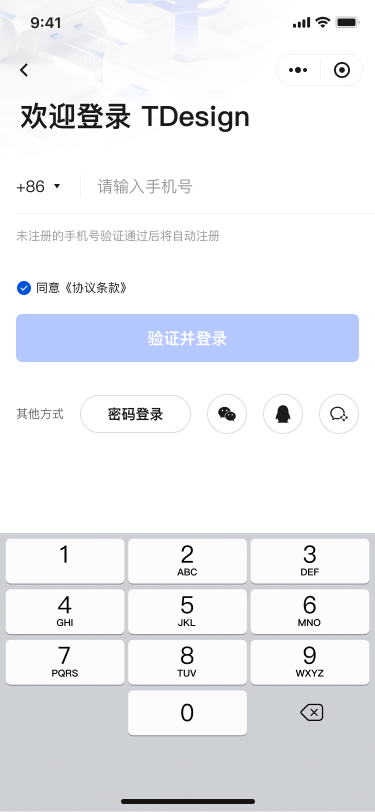
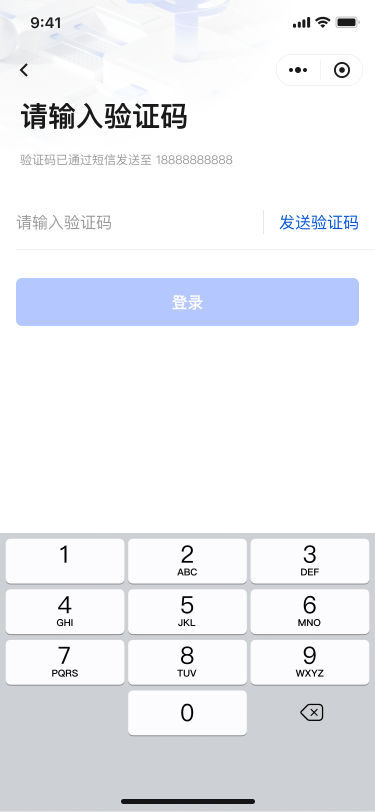
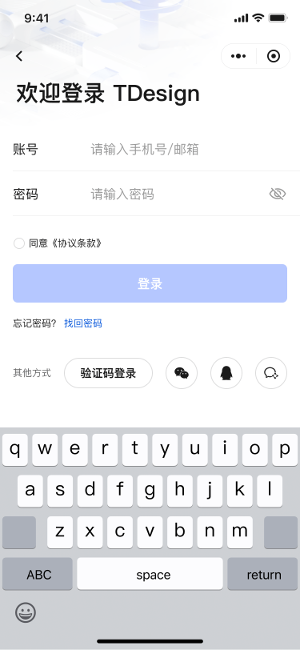

# Login

## Pages

- `/login/phone`: phone number input and send verification code
- `/login/verify`: verify code and sign in
- `/login/password`: password sign in

## APIs (Mock)

- `POST /api/auth/send-code`: send verification code
- `POST /api/auth/verify-login`: verify and issue token + user
- `POST /api/auth/password-login`: password login
- `POST /api/auth/logout`: sign out
- `POST /api/auth/refresh-token`: refresh token

## State

- `useUserStore`: stores `token` and `userInfo`, and injects `httpClient` after successful login
- Persistence key: `${storageNS}${USER_INFO}`; only `token` and `userInfo` are persisted

## Implementation Highlights

- Multiple login methods: SMS/password split with unified validation model, easy to extend for 3rd-party logins
- Security protections: throttle code requests and fallback to image captcha to reduce attack surface
- Failure retry: map error codes to messages with retry button to improve recoverability

## UI Preview

  
  
  

