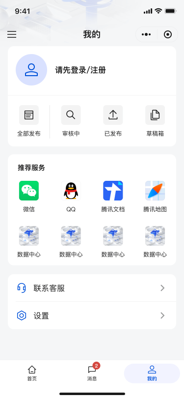
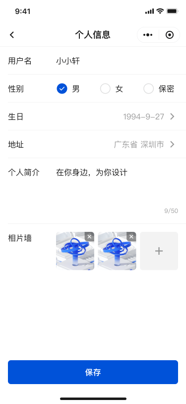

# My

- Composition: user card, service grid, settings/profile edit

## APIs (Mock)

- `GET /api/profile/services`: service grid and menu items
- `GET /api/profile/stats`: counters (All/Reviewing/Published/Drafts)
- `POST /api/profile/stats`: update a specific counter
- `POST /api/profile/service-click`: record service click

## Auth State Demo

- The sidebar provides a quick toggle for "Logged-in / Logged-out" (UI preview only). It simulates `token` and `userInfo` via internal methods in `useNavigation()`

## Implementation Highlights

- User state switching: login state simulated via store; components react automatically on toggle
- Service grid: responsive grid and accessibility optimizations (touch target and readability)
- Settings entry: async route lazy-loading and route-splitting to reduce unrelated overhead

### Address Picker & Region Data

The profile edit page provides an address picker (province/city/district) with modal selection and form fill-in:

- Component: `src/views/edit/components/AddressPickerModal.vue`
- Composable: `src/views/edit/composables/useAddressPicker.ts`
- Data source: `src/utils/area.ts`

Form integration:

```vue
<AddressPickerModal v-model:visible="show" @confirm="onConfirm" />
```

## UI Preview

<div style="display: flex; gap: 12px; align-items: flex-start;">
  
  
  
</div>
