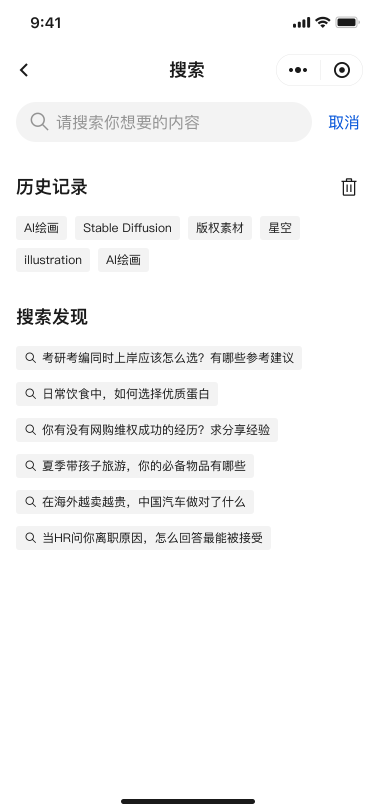

# Search

- Data: history tags, discoveries, `q` query suggestions/results
- Behaviors: input throttle/debounce; click history/suggestion to fill and trigger search

## APIs (Mock)

- `GET /api/search/history-tags`
- `GET /api/search/discoveries`
- `GET /api/search?q=keyword` (supports `AbortSignal` cancel)

## Interactions

- Input change triggers search; cancel the previous request on unmount or before the next input to avoid race conditions

## Implementation Highlights

- Debounce + request cancellation: throttle input with `AbortController` to reduce service pressure
- Smart suggestions: merge and sort by weights of history/discoveries, prioritizing highly relevant items
- Empty and error states: unified placeholders and retry button for consistent experience

### Debounce and Race Condition Handling

Recipe: `debounce + AbortController`. Cancel the previous request on the next input/unmount to ensure consistent results:

```ts
// Pseudo-code (aligned with project implementation)
let currentController: AbortController | null = null
const performSearch = async (q: string) => {
  // Cancel previous
  currentController?.abort()
  if (!q.trim()) return
  currentController = new AbortController()
  try {
    const res = await get(`/api/search?q=${encodeURIComponent(q)}`, undefined, currentController.signal)
    if (res.success && !currentController.signal.aborted) {
      // render results
    }
  } catch (e) {
    if ((e as any)?.name !== 'AbortError') {
      message.error('Search failed, please retry')
    }
  } finally {
    currentController = null
  }
}
```

## UI Preview

<div style="display: flex; gap: 12px; align-items: flex-start;">
  
</div>
