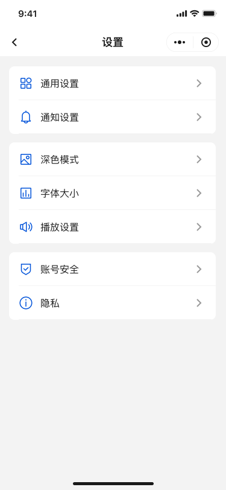

# Setting

- Composition: General settings, Dark mode (Black Mode)
- Route: `/my/settings` (entered from the My page)

## Modules

- `generalSettings.vue`: common settings (notifications, language, clear cache, etc.)
- `blackMode.vue`: dark mode toggle, powered by `useTheme()`

## Interactions

- Enter from the My page; toggling dark mode takes effect immediately across layout and components

## Implementation Highlights

- Theme switching: `useTheme()` mounts `theme-mode` on `:root`, styles driven by CSS variables
- Route lazy-loading: settings sub-routes are loaded on demand to avoid affecting Home FMP

## Code Locations

- Page: `src/views/setting/index.vue`
- Components: `src/views/setting/components/*`
- Theme: `src/composables/useTheme.ts`, `src/config/theme.config.ts`

## UI Preview

  

