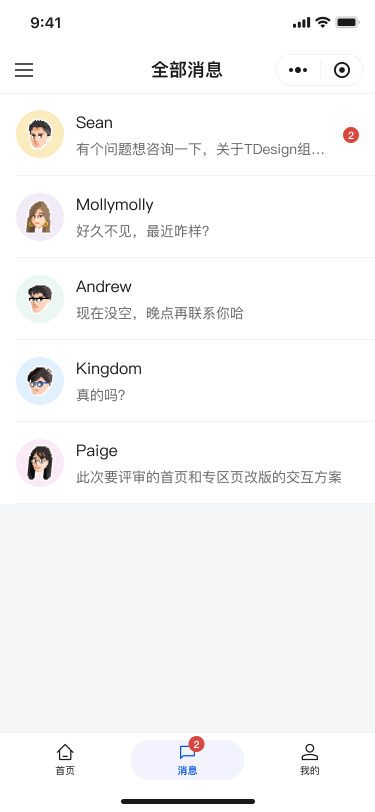
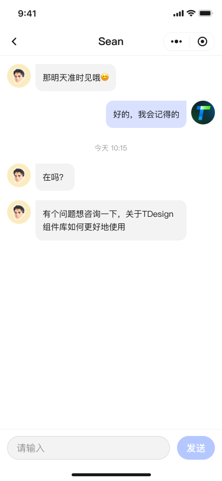

# Talklist

- Data: `/api/chat` list; send message, mark as read, unread total
- Behaviors: aggregate badges on bottom Tab; enter conversation, mark read, time dividers

## APIs (Mock)

- `GET /api/chat`: conversations aggregation
- `POST /api/chat/:chatId/message`: send message
- `PUT /api/chat/:chatId/read`: mark as read
- `GET /api/chat/unread-count`: total unread count

## Local Utilities

- `formatMessageTime(timestamp)`: Today/Yesterday/date format
- `shouldShowTimeDivider(cur, prev)`: show time divider when gap > 5 minutes

## Implementation Highlights

- Unread aggregation: bottom Tab badges linked with in-conversation read status for real-time consistency
- Performance: long list virtual scroll and grouped rendering to avoid reflow
- Input experience: send button states and retry on failure for better weak-network usability

## UI Preview

  
  

