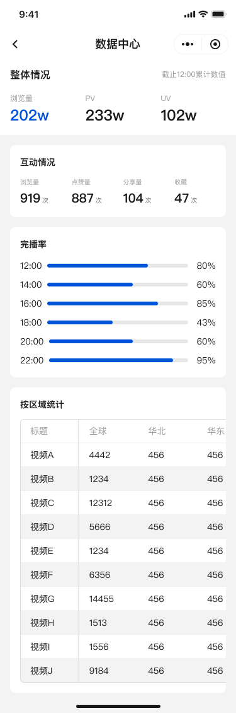

# 数据中心 DataCenter

## 目标

- 汇总核心指标：总览、互动、完成率、区域分布等

## 数据来源

- `GET /api/datacenter/stats`：返回 `overview`、`interaction`、`completion`、`regionData`、`regionColumns`
- `GET /api/datacenter/video/:id`：单条视频的区域统计详情

## 组成

- `OverviewSection`：概览指标
- `InteractionSection`：互动数据
- `CompletionSection`：完成率
- `RegionSection`：区域分布

## 实现亮点

- 图表渲染：按需加载图表库与组件懒注册，减小首屏包体
- 数据同步：统一数据模型与字段映射，保证多图表联动一致
- 空态策略：缺失数据时展示统一占位与说明，避免误导

## UI 预览

  

