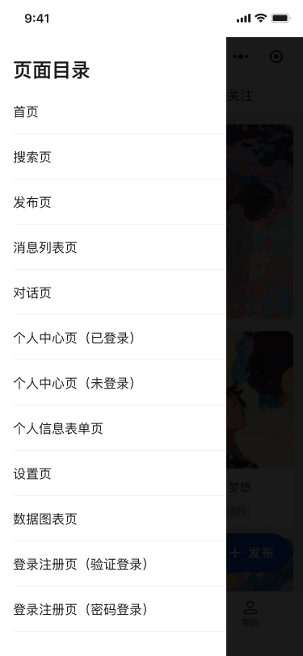

# 页面概览

- 首页（`/home`）：内容分发与服务入口；轮播、卡片、快捷入口
- 发布页（`/publish`）：标题/正文/标签/上传；草稿/发布
- 搜索（`/search`）：历史/发现/建议；输入联想与跳转
- 会话列表（`/talklist`）：会话与未读徽标聚合
- 数据中心（`/datacenter`）：总览、互动、完成率、区域
- 我的（`/my`）：用户卡片、服务网格、设置入口
- 登录（`/login/*`）：手机号、验证码、密码登录

## 实现亮点（通用）

- 组件解耦：每个页面由“容器 + 业务组件”组成，易于复用与替换
- 数据驱动：通过统一的请求封装与状态管理，页面状态与副作用清晰可控
- 体验优化：骨架屏/占位图、渐进加载、错误与空态友好处理
- 工程可维护：类型约束、单一职责的 hooks/composables，便于测试与扩展

## UI 预览

  

