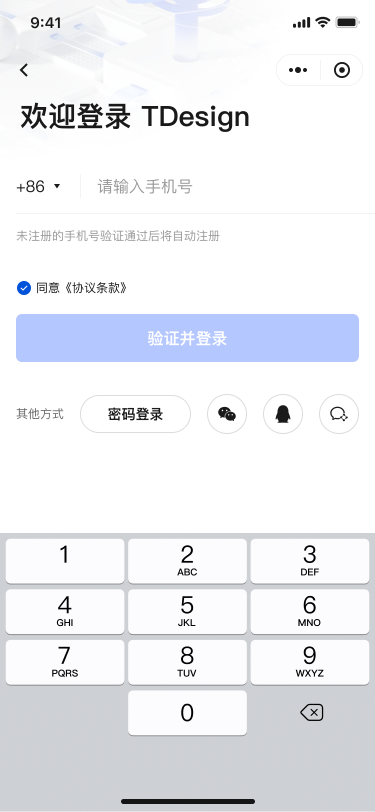

# 登录 Login

## 页面

- `/login/phone`：手机号输入与发送验证码
- `/login/verify`：验证码校验与登录
- `/login/password`：密码登录

## 接口（Mock）

- `POST /api/auth/send-code`：发送验证码
- `POST /api/auth/verify-login`：校验并下发 token + user
- `POST /api/auth/password-login`：密码登录
- `POST /api/auth/logout`：退出登录
- `POST /api/auth/refresh-token`：刷新 token

## 状态

- `useUserStore`：保存 token 与 userInfo，并在登录成功后注入 `httpClient`
- 持久化键：`${storageNS}${USER_INFO}`，仅持久化 `token` 与 `userInfo`

## 实现亮点

- 多方式登录：短信/密码分流与统一校验模型，便于扩展第三方登录
- 安全防护：验证码请求节流与图形校验兜底，降低攻击面
- 失败重试：错误码到文案映射与重试按钮，提升可恢复性

## UI 预览

  
  
  

