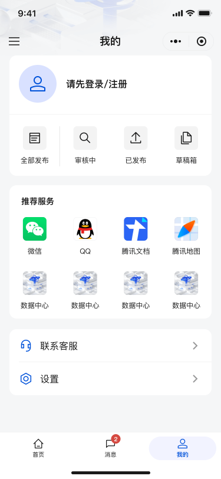
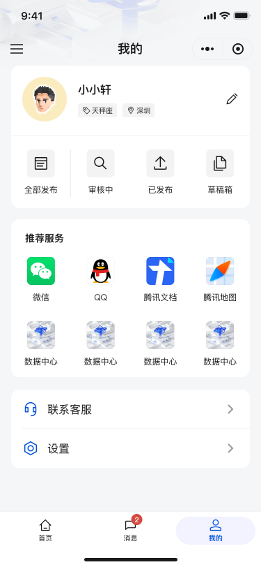

# 我的 My

- 组成：用户卡片、服务网格、设置/资料编辑

## 数据接口（Mock）

- `GET /api/profile/services`：服务网格与菜单项
- `GET /api/profile/stats`：统计项（全部发布/审核中/已发布/草稿箱）
- `POST /api/profile/stats`：更新指定统计项
- `POST /api/profile/service-click`：记录服务点击

## 登录态演示

- 侧边栏提供“已登录/未登录”快速切换入口（仅 UI 预览），通过 `useNavigation()` 内部方法模拟 `token` 与 `userInfo`

## 实现亮点

- 用户态切换：基于 store 的登录态模拟，切换后组件自动响应
- 服务网格：宫格自适应与可达性优化（触控区域与可读性）
- 设置入口：异步路由懒加载与分路由打包，减少无关开销

## UI 预览

  
    
  

